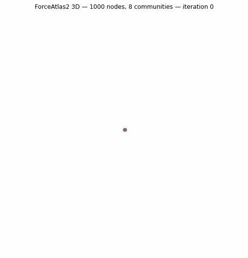

# ForceAtlas2 for Python

[](https://github.com/bhargavchippada/forceatlas2/actions/workflows/ci.yml)
[](https://pypi.org/project/fa2/)
[](https://www.python.org/downloads/)
[](https://www.gnu.org/licenses/gpl-3.0)

The fastest Python implementation of the [ForceAtlas2](http://journals.plos.org/plosone/article?id=10.1371/journal.pone.0098679) graph layout algorithm, with Cython optimization for 10-100x speedup.

<p align="center">
  
</p>
<p align="center"><em>500-node stochastic block model (7 communities) laid out with ForceAtlas2 LinLog mode</em></p>

<p align="center">
  
</p>
<p align="center"><em>1000-node stochastic block model (8 communities) laid out in 3D with ForceAtlas2 LinLog mode</em></p>

## Key Features

- **Fast**: Cython extension provides 10-100x speedup over pure Python
- **Scalable**: Barnes-Hut approximation for O(n log n) complexity
- **N-dimensional**: 2D, 3D, and higher-dimensional layouts via `dim` parameter
- **Anti-collision**: `adjustSizes` prevents node overlap (Gephi parity)
- **Auto-tuning**: `inferSettings()` selects parameters based on graph characteristics
- **Multiple backends**: Cython, NumPy vectorized, or pure Python fallback
- **Flexible input**: NetworkX, igraph, NumPy arrays, or SciPy sparse matrices
- **Reproducible**: Seeded layouts via `seed` parameter
- **Observable**: Callbacks for animation and iteration monitoring

## Quick Example

```python
import networkx as nx
from fa2 import ForceAtlas2

G = nx.karate_club_graph()

fa2 = ForceAtlas2(linLogMode=True, verbose=False)
positions = fa2.forceatlas2_networkx_layout(G, iterations=100)
```

## What's New in v1.0.0

- **N-dimensional layout** (`dim` parameter) — 2D, 3D, and beyond
- **`adjustSizes`** — anti-collision forces prevent node overlap
- **`inferSettings()`** — auto-tuning based on graph characteristics
- **`normalizeEdgeWeights`** and **`invertedEdgeWeightsMode`**
- **NumPy vectorized backend** — 10-16x faster than pure Python loops
- **`store_pos_as`** — save positions as node attributes
- **`size_attr`** — read node sizes from graph attributes

[Get Started](getting-started.md){ .md-button .md-button--primary }
[API Reference](api/forceatlas2.md){ .md-button }
